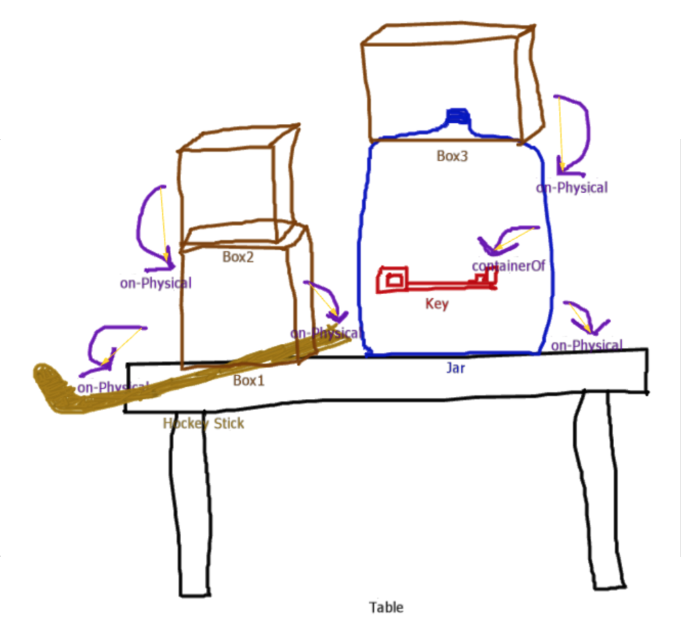

# Escape-Room
Escape-Room is an exploration of hierarchical planning, commonsense reasoning, and spatial reasoning with Companions. We designed "escape room" challenges and designed a Companions agent to implement reasoning to solve the challenge. In these challenges, our agent is trapped in a room. In order to escape, the agent needs to fetch the key to unlock the door and escape the room. Various obstacles that the agent must overcome to escape the room include accessing keys underneath stacks of boxes, within jars, within multiple jars, and likewise for tools that may similarly be inaccessible, but are necessary to escape!.

## Description of Capabilities
This implementation was designed to model several aspects of intelligent reasoning:
1. Reasoning about spatial relations (on-relations and containment relations) and how they affect the ability to access an object
2. Recursive reasoning - Allows for flexibility in reasoning, so that the agent can carry out an unlimited number of steps without needing to know the entire plan in advance (i.e., the agent can work on accessing a hammer obscured in multiple ways until it is successful). 
3. Common Sense Reasoning
    * Object Affordances - only certain objects can break jars, etc.
    * Accessibility - an object is not accessible if it is obscured in some way (e.g., something is on top of it, or it is contained by another object)
    * Planning the correct order of actions - An object can only be interacted with if it is accessible. For example, you can only move a box if it is clear on top. If you have several objects stacked on one another, they must be removed in a certain order (i.e., from top to bottom)
4. Generality - we attempted to model the entities, relations, and methods at a high level of generality, to allow for more flexibility in reasoning. For example:
    * Our system considers which tools to use to break a jar based on whether or not they are a PoundingDrivingImplement [1], rather than based on specific instances like "Hammer." 
    * We tried to keep our methods for interacting with objects general as well. Through the use of only 8 methods and 5 horn clauses - our system is able to handle a wide variety of tasks, and can use the same methods to interact with different types of objects. Thus we attempted to avoid unintelligent (and psychologically-implausible) object-specific planning and action taking. 
5. Executing the plan with the optimal number of steps - When multiple paths are available, the reasoner will choose the path that results in the optimal number of steps. If two different paths are equivalent, it will choose arbitrarily (which can sometimes result in some behavior that would be strange for humans - i.e., going for an obscured hammer before an accessible).

Footnote [1]: We tried to use transitive class inference (Hockey stick --> SportsPoundingDrivingImplement --> PoundingDrivingImplement) to allow for both local specific declaration and abtract reasoning in planning. Though the reasoning is successful, there is issue inside Companion that return names of other subclasses in recording the steps in MyEscapePlanMt (e.g., golf club instead of hockey stick). Therefore, we chose to use local abstract declaration.

## Using with CogSketch
Our original intent was to have our reasoner be able to communicate with CogSketch, allowing the user to draw a novel level (within constraints), and have the reasoner be able to solve that new level. Unfortunately, we couldn't figure out how to get the two to interface. But, as discussed above, we did attempt to write our code at a level of generality that would make future interface with CogSketch easy. We invite anyone who is able to connect the two to give it a try. 

## Overview of Files
Escape-Room consists of:
1. EscapeMt, which defines methods for solving the challenges.
2. EscapeOntologyMt, which initializes the methods.
3. Six "levels," which each contain a microtheory that contain facts that represent a challenge that the agent must solve. In each level, the agent must fetch the key to escape from the room.

## Usage
1. Download each of the krf files and start a companion.
2. Run (doClearWorkingMemory).
3. Use "Load Flatfile" in session-reasoner to load EscapeMt, EscapeOntologyMt, and LevelOneMt.
4. Run (fetch K1 LevelOneMt).
5. Search MyEscapePlanMt in the knowledge base to see the agent's actions in this level. You may also want to turn on Profiler before step 4 and see the steps in order in the profiler.
6. If you want to run the next level, first run (doForgetKBMt MyEscapePlanMt)
7. Load the level you want to run next as a flatfile.
8. Run (fetch K1 < mt-name >) where < mt-name > is the level you want to run. Repeat steps 5-8 for the rest of the levels.
9. IMPORTANT: If you wish to run a certain level more than once, in between each run you must forget the level's microtheory and reload the flatfile. 

# Levels
### Level 1
There is a key on top of the box. The agent fetches the key and escapes the room. 

#### Reasoning Steps
1. Attempt to fetch the key
    * The key is on the box, which means it’s accessible
2. Fetch the key and escape!

### Level 2
The key is in a jar on a table. There is also a hammer on the table. The agent fetches the hammer, breaks the jar, fetches
the key and escapes the room.

#### Reasoning Steps
1. Attempt to fetch Key1
    * The key is in the jar, which means it’s not accessible
2. Attempt to fetch and break the jar
    * The jar is on the table, which means it’s accessible
3. Fetch the jar
4. Attempt to fetch a hammer to break the jar
    * The hammer is on the table, which means it’s accessible 
5. Fetch the hammer and break the jar
6. Fetch the key and escape!

### Level 3
The key is on a table, but there a three boxes on top of it. The agent removes the top box, and then removes the box that was underneath it, then removes the last box on top of the key. Then the agent fetches the key and escapes the room.

#### Reasoning Steps
1. Attempt to fetch the key
    * Fail because something is on top of it (key not accessible) 
2. Attempt to remove what’s on top
    * Box1 needs to be removed, but there is another thing on top of it (Box1 not accessible)
    * Recursively check the condition and remove the top-most object  
3. Repeat steps 1 and 2 until the top of the key is clear.
4. Fetch the key and escape!

### Level 4
There is a jar on the table. The key is inside the jar. There is a box on top of the jar. There is also a hammer on the table,
and there are two boxes on the hammer. The agent removes the box from on top of the jar. Then, the agent removes the top box
from the hammer, and then removes the other box from the hammer. The agent breaks the container with the hammer, fetches the
key, and escapes the room.

#### Reasoning Steps
1. Attempt to fetch the key 
    * (in a jar)
2. Attempt to fetch and break the jar 
    * (covered by something)
3. Attempt to remove what’s on top of the jar
4. Remove Box3 and fetch the jar
    * (Box3 is accessible)
5. Attempt to fetch a hockey stick to break the jar 
    * (covered by something)
6. Attempt to remove the top-most thing on the stick recursively. 
7. Fetch the stick and break the jar
8. Fetch the key and escape!

### Level 5
There is a jar on the table which contains another jar. The inner jar contains the key. There is a box on top of the jar. There are two hammers on the table. One of the hammers has two boxes on it. The agent takes the box off the jar. Then the agent fetches the uncovered hammer and smashes the outer jar. The hammer breaks in the process. The agent takes each box off the covered hammer, fetches it, and uses it to break the inner jar. The agent fetches the key and escapes the room.

#### Reasoning Steps
1. Attempt to fetch the key (in Jar1, who is in Jar2)
2. Attempt to fetch and break Jar2 (covered by something)
3. Attempt to remove what’s on top of Jar2
4. Remove Box3 (accessible) and fetch Jar2
5. Attempt to fetch a hammer to break Jar2 (Hammer1 covered by something)
6. Attempt to remove the top-most thing on Hammer1 recursively. 
7. Fetch Hammer1 and break Jar2 (Hammer1 broken)
8. Fetch Jar1
9. Attempt to fetch another hammer to break Jar1 (Hammer2 is on the table)
10. Fetch Hammer2 and break Jar1 (Hammer2 broken)
11. Fetch the key and escape!

### Level 6
There are two jars on the table. One has a key in it, and one has a hammer in it. The jar containing a key has one box on it, and the jar containing a hammer has two boxes on it. There is also a hammer on the table. The agent takes the box off of the jar containing a key. It uses the uncovered hammer to break the jar. The agent fetches the key and escapes the room. This level demonstrates that the agent ignores the chance to smash open the second jar, and instead takes the most straightforward path to achieving its goal.

#### Reasoning Steps
1. Attempt to fetch the key (in Jar1)
2. Attempt to fetch and break Jar1 (covered by something)
3. Attempt to remove what’s on top of the jar
4. Remove Box3 (accessible) and fetch the jar
5. Attempt to fetch a hammer to break Jar1
    * Compare to decide which hammer is more accessible (executed with the lower cost)
    * Hammer1 is in another jar covered by boxes, and Hammer2 is on the table.
6. Fetch Hammer2 and break Jar1
7. Fetch the key and escape!

